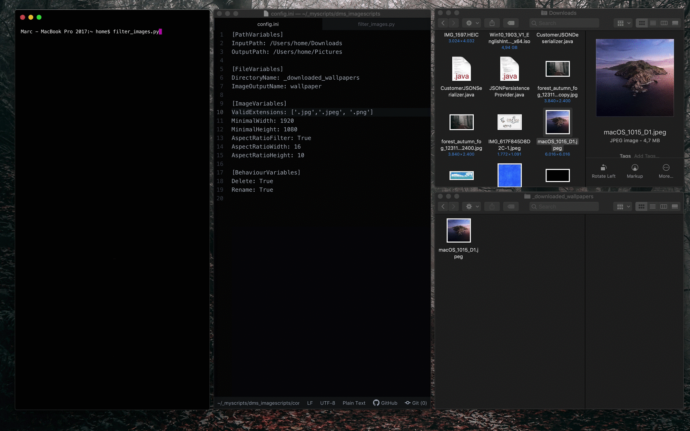

# Image file filter

> A simple Python script that copies image files with predefined properties to a new folder.

## Table of Contents

- [Image file filter](#Image-file-filter)
  - [Table of Contents](#Table-of-Contents)
  - [Getting Started](#Getting-Started)
    - [Prerequisites](#Prerequisites)
    - [Installing](#Installing)
    - [Configure](#Configure)
      - [[PathVariables]](#PathVariables)
      - [[FileVariables]](#FileVariables)
      - [[ImageVariables]](#ImageVariables)
      - [[BehaviourVariables]](#BehaviourVariables)
  - [How to use](#How-to-use)
  - [Built With](#Built-With)
  - [Versioning](#Versioning)
  - [License](#License)

## Getting Started

These instructions will get you a copy of the project up and running on your local machine. You will also be introduced to how you can customize the behavior of the script.

### Prerequisites

You need Pillow - Python Imaging Library (PIL)

```bash
pip install Pillow
```

or use the [requirements.txt](requirements.txt)

```bash
pip install -r requirements.txt
```

### Installing

Clone this repository or download the zip.

1. `cd` in the path in which the repo should be downloaded!
2. `git clone git@github.com:devmarcstorm/automatic-image-file-filter.git`
3. `cd image_file_filter`

### Configure

Here you will find a ***config.ini***, which should look like this:

```ini
[PathVariables]
InputPath: /Users/home/Downloads
OutputPath: /Users/home/Pictures

[FileVariables]
DirectoryName: _downloaded_wallpapers
ImageOutputName: wallpaper

[ImageVariables]
ValidExtensions: ['.jpg','.jpeg', '.png']
MinimalWidth: 1920
MinimalHeight: 1080
AspectRatioFilter: True
AspectRatioWidth: 16
AspectRatioHeight: 10

[BehaviourVariables]
Delete: True
Rename: True
```

#### [PathVariables]

First, you should set the **InputPath** and **OutputPath**. Here you have to specify the paths to the directories where the script should filter the images and copy them out or copy them into it.

#### [FileVariables]

**DirectoryName:** This folder is created by the script and the filtered images end up here.

**ImageOutputName:** If you choose to have the images renamed automatically this string will be used before the image index. `wallpaper_0`, `wallpaper_1`...

#### [ImageVariables]

**ValidExtensions:**  The script will search for images with these file extensions. In that case you enter an extension which is not supported by PIL a simple error message will be displayed for this file `ERROR: cannot identify image file '/Users/home/Downloads/test.zip'` but the script continues to run normally for the rest of the images.

**MinimalWidth and MinimalHeight:** These variables determine the minimum resolution of the images to be used.

**AspectRatioFilter:** This value determines whether or not to filter by the aspect ratio.

#### [BehaviourVariables]

**Delete:** If this option is selected all images in the output directory will be deleted so that only the currently copied images are available.

**Rename:** If this option is selected, all images in the output directory are renamed according to the rules described [above](#[FileVariables]).

## How to use

1. `cd` in the directory where the script is located
2. Simply run: `python filter_images.py`



*You can add the directory to your PATH variables of your system.. Then you can run `filter_images.py` from any path.*

*(Example for macOS: In `/Users/<username>/.bash.profile`: `export PATH="$PATH:<path to directory>"`)*

## Built With

- [Python3](https://www.python.org/) - Programming language
- [Pillow](https://python-pillow.org/) - (PIL) Python Imaging Library

## Versioning

For the versions available, see the [tags on this repository](https://github.com/devmarcstorm/automatic-image-file-filter/tags).

## License

This project is licensed under the MIT License - see the [LICENSE](LICENSE) file for details
